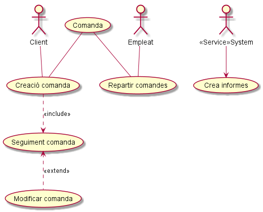
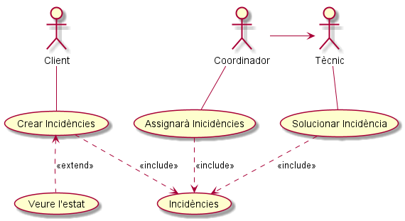

###### Sara Caparrós (DAW1 - Curs 2018/2019)

# AEA.3.2.1. Iniciació Diagrames de casos d'ús

## 1. Restaurant
1.	El restaurant de menjar ràpid MenVaigALaRuina vol una aplicació que li permeti gestionar les comandes creades pels seus clients permetent-los dur un seguiment de la seva comanda i modificar les comandes abans de que es reparteixin. A més, vol dur un seguiment de les comandes repartides pels seus empleats mitjançant informes que realitzarà la pròpia aplicació. Realitza un diagrama de casos d'ús per al restaurant.

   
[PlantUML Restaurant](./PlantUML/Restaurant.puml "Restaurant.puml")

## 2. Incidències
2.	Creeu un software per un gestor d'incidències que utilitzi els següents rols d'usuari: 
-	Client, és un usuari que podrà crear incidències i veure l'estat en el que es troben 
-	Tècnic, és un usuari que realitzarà intervencions per solucionar la incidència 
-	Coordinador, és un usuari que assignarà incidències a un tècnic. 

   
[PlantUML Incidencies](./PlantUML/Incidencies.puml "Incidencies.puml")