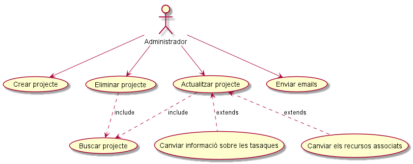
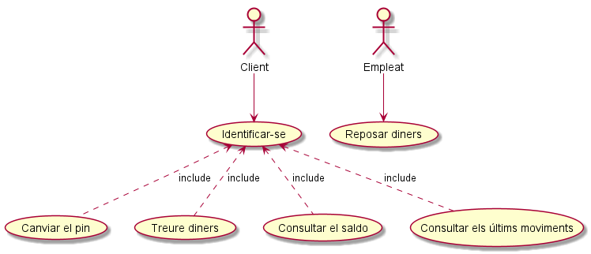
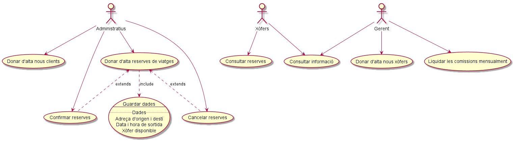

###### Sara Caparrós amb Jose Alberto Torrents (DAW1 - Curs 2018/2019)

# AEA.3.2.1. Iniciació Diagrames de casos d'ús

## 1. GestióProjectes
1.	GestióProjectes: En una oficina es du a terme la gestió de projectes. La única persona que controla els projectes és l’administrador, les funcions del qual són les següents: 
- Pot agregar, eliminar i actualitzar un projecte, però per eliminar-lo o actualitzar-lo és necessari trobar el projecte en qüestió. 
- A l’hora d’actualitzar un projecte només es poden donar dues situacions: canviar la informació sobre les tasques del projecte o canviar els recursos associats al projecte. 
- Per informar a tots els membres de l’equip sobre els avanços en el  projecte s’envia un document per e-mail.

   
[PlantUML GestioProjectes](./PlantUML/GestioProjectes.puml "GestioProjectes.puml")

## 2. Caixer
2.	Caixer: Escriu un diagrama de casos d’ús per modelar la interacció d’un client i un empleat d’un banc amb un caixer automàtic. No utilitzis relacions <<extend>> ni <<include>>. Les especificacions són les següents: 
- El caixer el pot utilitzar el client del banc i l’empleat de la sucursal 
- El client ha d’identificar-se al caixer abans de realitzar qualsevol operació
- El client pot canviar el pin, treure diners, consultar el saldo i consultar els últims moviments. 
- L’empleat utilitza el caixer només per reposar diner.

   
[PlantUML Caixer](./PlantUML/Caixer.puml "Caixer.puml")

## 3. RadioTaxi
3.	RadioTaxi: Realitza un diagrama de casos d’ús per una empresa de Radiotaxis que ha sol·licitat el desenvolupament d’un sistema que li doni suport als seus processos clau. 
Hi ha tres tipus d’usuaris : administratius, xofers i el gerent. 
Els requeriments són els següents: 
3.1. Els administratius de l’empresa de Radiotaxis podran: 
•	Donar d’alta nous clients.
•	Donar d’alta reserves de viatges indicant el client, el xofer sol·licitat, l’adreça d’origen, la de destí i la data i hora de sortida. Serà necessari comprovar les dades del xofer sol·licitat per saber si està lliure. Si al donar d’alta una reserva, el client no existeix al sistema, es podrà donar d’alta directament. Des d’aquí també es podrà confirmar la reserva que s’està creant.
•	Cancel·lar i confirmar les reserves ja donades d’alta. 
3.2. Els xofers podran consultar les reserves que tenen assignades per al dia de la data. 
3.3. El gerent podrà donar d’alta nous xofers al sistema i liquidar les comissions dels xofers mensualment, per això es necessita consultar la informació del xofer. 

   
[PlantUML RadioTaxi](./PlantUML/RadioTaxi.puml "RadioTaxi.puml")

