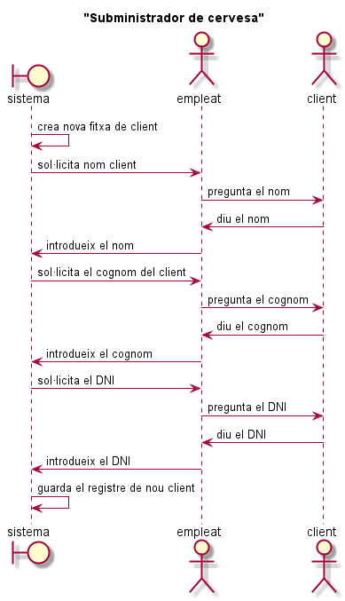

###### Sara Caparrós amb Jose Alberto Torrents (DAW1 - Curs 2018/2019)

# AEA.3.2.2. Avançat Diagrames de casos d'ús

## 1. Subministrador de cervesa
1. Subministrador de cervesa. Un bar decideix canviar de subministrador de cervesa i truca a la nova empresa. L’empleat que li agafa el telèfon li explica que ha de guardar les seves dades al sistema, així que obre una nova fitxa de client al sistema. Es demana fer el diagrama de seqüència per la següent situació.
•	El sistema genera una nova fitxa de client
•	El sistema sol·licita a l’empleat que introdueixi un nom de client.
•	L’empleat li pregunta al client el nom i el client li respon
•	L’empleat introdueix al sistema el nom que li ha donat.
•	El sistema demana a l’empleat que introdueixi un cognom de client.
•	L’empleat li pregunta al client el cognom i el client li dicta
•	L’empleat introdueix al sistema el cognom que li ha donat.
•	El sistema sol·licita a l’empleat que introdueixi un dni pel client
•	L’empleat li pregunta al client el dni i el client li diu.
•	L’empleat introdueix al sistema el dni que li ha donat.
•	El sistema guarda el registre del nou client

   
[PlantUML SubministradorCervesa](./PlantUML/SubministradorCervesa.puml "SubministradorCervesa.puml")

## 2. Casa
2.	Casa: Disposem de les següents classes Java:
```
public class Porta {

  private double alçada;
  private double amplada;

  public Porta(double alçada, double amplada) {
    this.alçada = alçada;
    this.amplada = amplada;
  }

  public double getAlçada() {
    return alçada;
  }

  public void setAlçada(double alçada) {
    this.alçada = alçada;
  }

  public double getAmplada() {
    return amplada;
  }

  public void setAmplada(double amplada) {
    this.amplada = amplada;
  }
}

 
public class Finestra {

  private double alçada;
  private double amplada;

  public Finestra(double alçada, double amplada) {
    this.alçada = alçada;
    this.amplada = amplada;
  }

  public double getAlçada() {
    return alçada;
  }

  public void setAlçada(double alçada) {
    this.alçada = alçada;
  }

  public double getAmplada() {
    return amplada;
  }

  public void setAmplada(double amplada) {
    this.amplada = amplada;
  }
}

public class Habitacio {

  private Porta porta;
  private Finestra finestra;
  private double metres;

  public Habitacio(double metres) {
    this.metres = metres;
  }

  public Porta getPorta() {
    return porta;
  }

  public void setPorta(Porta porta) {
    this.porta = porta;
  }

  public Finestra getFinestra() {
    return finestra;
  }

  public void setFinestra(Finestra finestra) {
    this.finestra = finestra;
  }

  public double getMetres() {
    return metres;
  }

  public void setMetres(double metres) {
    this.metres = metres;
  }

  @Override
  public String toString() {
    return "Habitació de " + metres + "m2";
  }
}
import java.util.ArrayList;

public class Casa {

  private int numHabitacions;
  private ArrayList<Habitacio> habitacions;

  public Casa(int numHabitacions) {
    this.numHabitacions = numHabitacions;
    this.habitacions = new ArrayList<Habitacio>(numHabitacions);
  }

  public void afegirHabitacio(Habitacio h) {
    habitacions.add(h);
  }

  public int getNumHabitacions() {
    return numHabitacions;
  }

  public ArrayList<Habitacio> getHabitacions() {
    return habitacions;
  }

  public void mostrarHabitacions() {
    for (Habitacio h : habitacions) {
      System.out.println(h);
    }
  }
}
```

Es demana construir el diagrama de seqüència pel mètode main() de la classe ConstruirCasa
```

public class ConstruirCasa {
    public static void main(String[] args) {
        Casa c = new Casa(1);
        Habitacio h = new Habitacio(15);
        Porta p = new Porta(2.10, 1);
        h.setPorta(p);
        Finestra f = new Finestra(1.60, 1.20);
        h.setFinestra(f);
        c.afegirHabitacio(h);
        System.out.println("La casa té " + c.getNumHabitacions() + " habitacions");
        c.mostrarHabitacions();
    }
}
```


   
[PlantUML Casa](./PlantUML/Casa.puml "Casa.puml")
